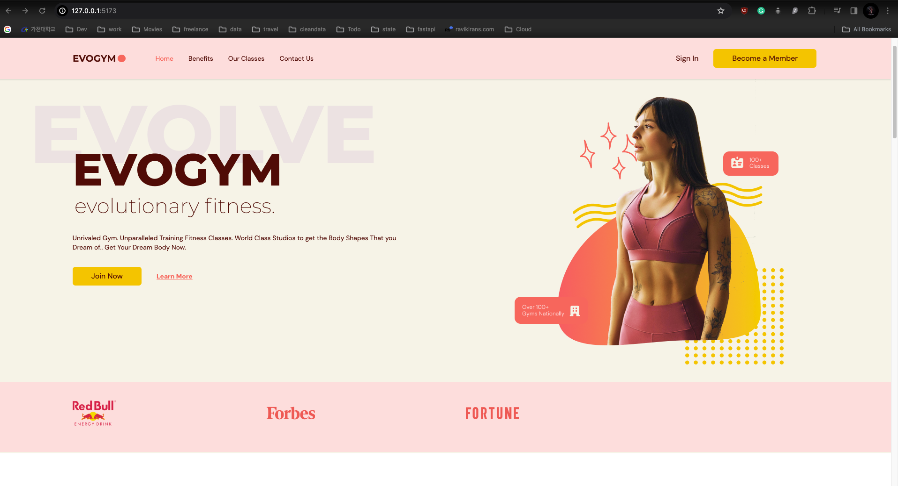

### FitnessApp

- Sign up to cloudflare for hosting account `cloudflare.com`.
- On the Dashboard access the workers and pages section.
- Click pages and the connect with your github or gitlab account.
- Select the repo you wish to deploy and press begin set-up.
- Select the branch, build command `npm run build` and output directory `dist`.
- Add Node version for your project in the Environment variables-advanced`NODE_VERSION = 16.20.2`.
- Save and deploy.
- 
